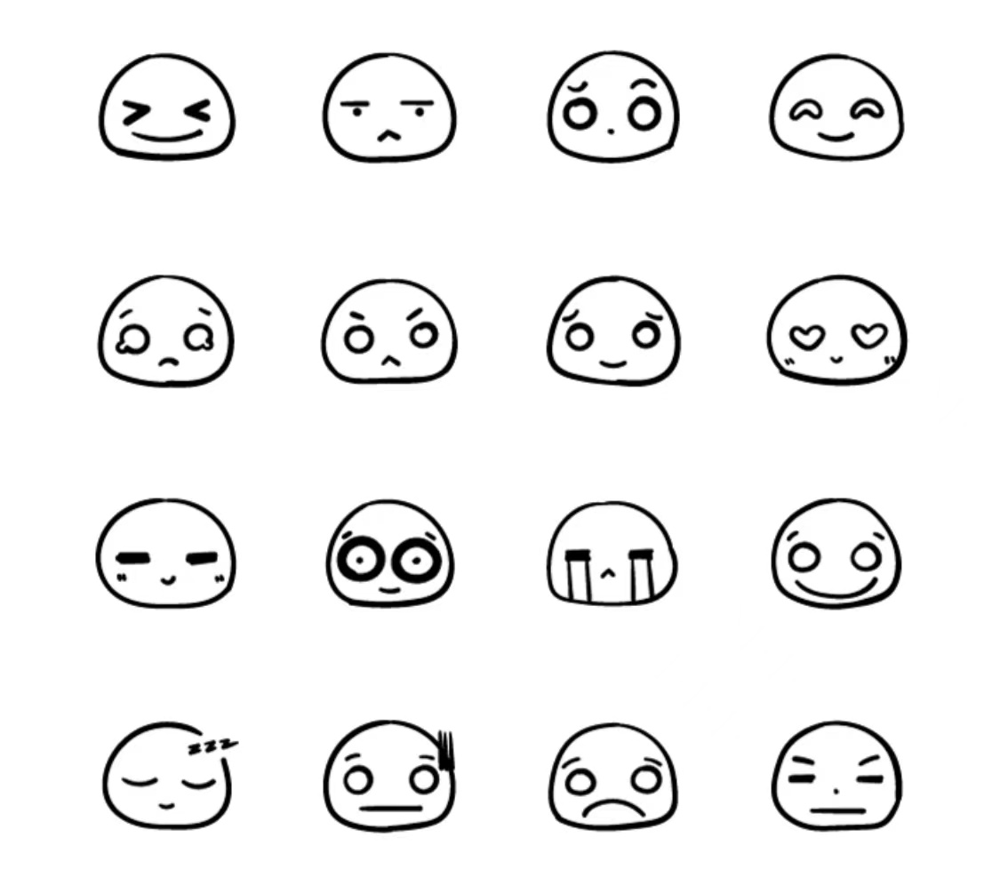

In the fall right before COVID-19 happend, I created a set of WeChat stickers. It started from my [compile-time doodling](sketches.html) in the summer, and later became my weekend project when I realized that publishing WeChat stickers is not that complicated as I imagined. I also wrote a bunch of [Adobe Illustrator scripts](https://github.com/qinyeli/illustrator_scripts) to batch process the images to the required format, which was fun :D

It has been downloaded 3000+ times, and I am really proud of it!

You can download it from here

© sindyleaf